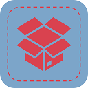

# HouseholdOrganizer - Api

A progressive web app for collaborative digital management and dissolution of a household. I built this app to organize a household I needed to straighten and dissolute during the corona virus pandemic in 2020. By using this app I my family was able to select items they wanted to keep easily in a smartphone app. Furthermore, it allowed to pack everything together whilst storing the locatin information in a database to digitally search for stuff and getting a position in a shelf or box as a result.

This app was built with [Nuxt.js](https://v2.nuxt.com/) as a progressive web app and connects to a [REST API written in Java](https://github.com/thlemm/HouseholdOrganizer-API).

## Features

* Add stuff by taking a picture and adding some meta data
* Save the location of stuff (shelf, box, Item-ID, ...)
* Enable people to select stuff they like to have
* Search for stuff by category, historical location or keywords
* See what's inside of a box without opening it
* Get an overview of stuff you marked to keep for your self

## Screenshots
### See details of stuff

### List your stuff

### Search for stuff and get it's location

### Select stuff you want to keep

